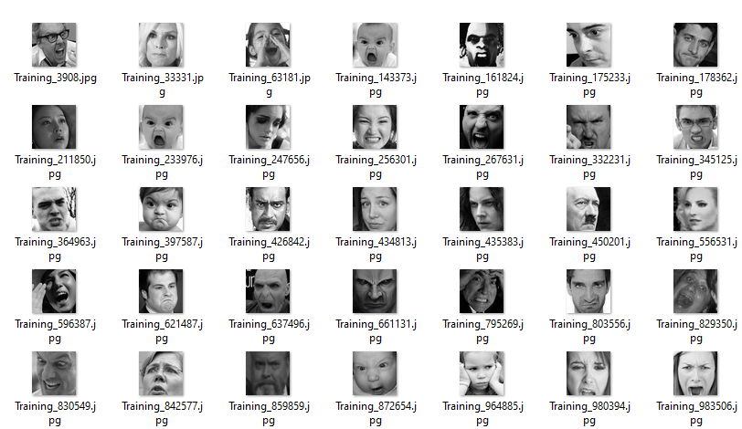
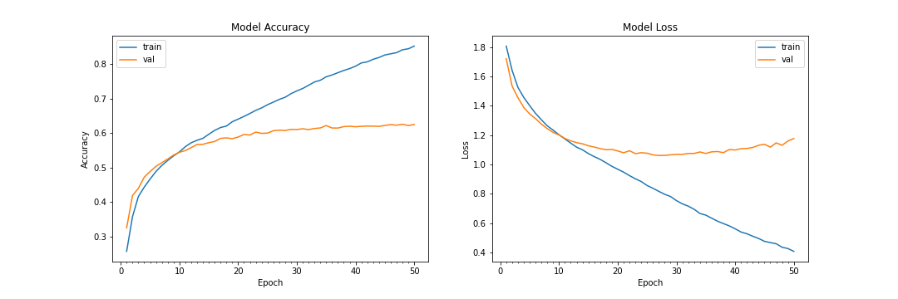
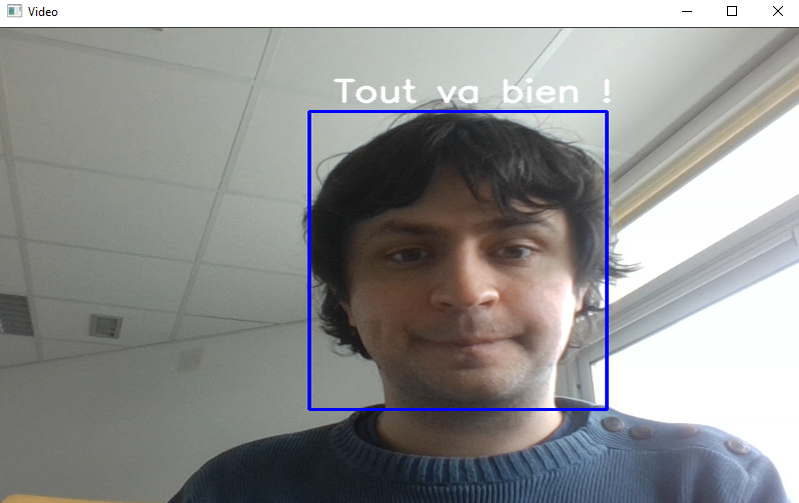

# Brief_Emotions_Visage

## Dataset

Préalablement divisé en set ``train`` de 28709 images (de 48x48 pixels, montrant des visages en noir et blanc) et de ``test`` de 7178, chacun subdivisé en sept dossiers correspondants à sept émotions (``angry``, ``disgust``, ``fear``, ``happy``, ``neutral``, ```sad`` et ``surprise``).

Observation : Si la plupart des images correspondent clairement à leur catégories, beaucoup sont plus ambigües.



Exemple d'émotions supposément de colère.

## Architecture

Le modèle est ``Sequential`` de ``tensorflow.keras``, auquel sont ajouté les spécifications d'amélioration de ``keras`` (``Conv2D``, ``MaxPooling2D``, ``Dropout``, ``Flatten``, ``Dense``).

Les données sont récupérées grâce à ``ImageDataGenerator``, que l'on renseigne sur le format des images en lui donnant comme instruction de diviser leurs valeurs par 255 pour l'entraînement.

Le nombre d'époque est de 50, la taille des batches de 64. L'entraînement étant long, le modèle est entraîné une fois puis sauvegardé dans ```model.h5``.

Une fonction affiche un histogramme ``matplotlib`` sur les variations de précision/accuracy et de pertes. Il est enregistré en image ``plot.png``. Il montre que la précision plafonne à environ 60% sur les données de test. 



## Application sur webcam

Le feed de la webcam est récupéré avec ``cv2``, le visage identifié grâce à ``CascadeClassifier``, le modèle enregistré fait une prédiction sur l'émotion du visage, puis ``cv2`` affiche sur l'écran vidéo un message correspondant à l'émotion.



Nous n'avons pas réussi à inclure des emojis dans le message, ceci n'étant pas reconnus par la police utilisée.

Le feed vidéo est fermé avec la touche ``Q``.
